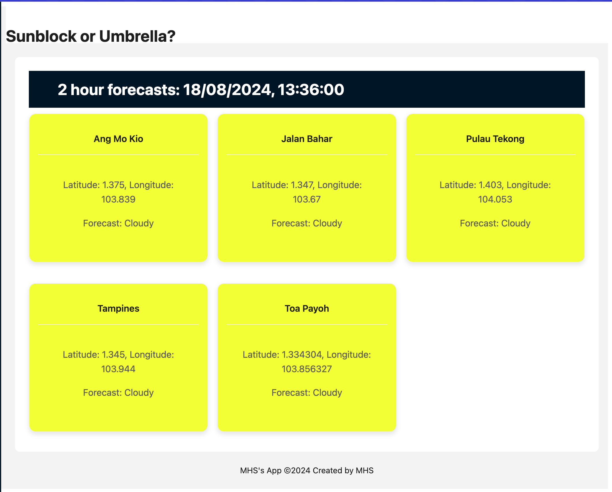
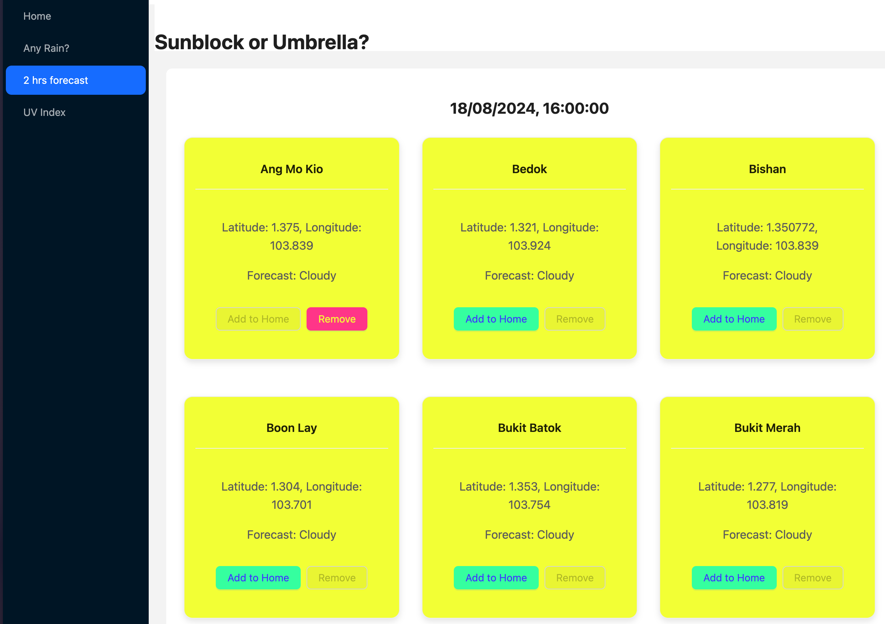

# Sunblock or Umbrella?

**Overview**

## Key Features

**Ability to favourite areas by adding areas to Home**

Areas which have been added to home will have the 'Add to Home' button ghost out and disabled. Users can favourite multiple areas
without being directed to the Home page. Users can also remove these areas by clicking on 'Remove'.

## Attributions & Credits

- ChatGPT: Some assistance was needed to help map the objects fetched from the API. Prompts include: "How to map {object} to {'Area':'ID} etc.
- [Ant Design](https://ant.design//)
- [Airtable](https://airtable.com/)

## Technologies Used

- Frontend: HTML, CSS, JavaScript, React
- Database: Airtable (for storing travel logs and associated data)
- APIs: Open Data Gov Singapore
- UI Framework: Ant Design (for responsive design and user interface components)

## Next Steps

- Enhance User Notifications: Integrate application to a trip / itinerary planning application. Allow the user to use weather forecasts to plan outdoor activies.
